# 🎨 Agentic Image Editor

> **A Multi-Agent System for Intelligent Image Editing powered by LangGraph**


The **Agentic Image Editor** is an advanced AI-powered application that allows users to edit images using natural language instructions. Unlike traditional filters, this system understands your intent, plans the necessary technical steps, executes them using FFmpeg, and visually verifies the result—all orchestrated autonomously by a graph of specialized AI agents.

## ✨ Key Features

- **Natural Language Editing**: Simply describe what you want (e.g., *"Make it look cinematic with warm tones"*).
- **Multi-Agent Architecture**: Five specialized agents work together to analyze, plan, execute, and verify.
- **Visual Intelligence**: Uses LLaVA/Llama-Vision to "see" the image and understand its content.
- **Self-Correcting**: If an edit fails or doesn't match the prompt, the system detects the error and retries with a corrected plan.
- **Dual Interface**: Use the beautiful Streamlit web UI or the robust CLI for batch processing.

---

## 🏗️ Architecture

The system is built on **LangGraph**, where the flow of execution is determined by a state machine.

```mermaid
graph TD
    Start([User Input]) --> Analyze[🔍 Image Analyzer]
    Analyze --> Plan[📋 Query Planner]
    Plan --> Generate[⚙️ Command Generator]
    Generate --> Execute[🎬 Executor]
    
    Execute -- Success --> Verify[✅ Vision Verifier]
    Execute -- Error --> Generate
    
    Verify -- Verified --> End([Finish])
    Verify -- Not Verified --> Plan
```



### The Agent Team

1.  **🔍 Image Analyzer Agent**:
    -   **Role**: The "Eyes".
    -   **Model**: Vision Model (e.g., Llama-Vision).
    -   **Task**: Analyzes the input image, describes the scene, identifies areas of focus, and suggests technical adjustments based on the user's request.

2.  **📋 Query Planner Agent**:
    -   **Role**: The "Strategist".
    -   **Task**: Translates the user's high-level request (and the Analyzer's notes) into a concrete list of technical edit steps (e.g., *"increase contrast by 20%", "apply vignette"*).

3.  **⚙️ Command Generator Agent**:
    -   **Role**: The "Engineer".
    -   **Task**: Converts the abstract edit steps into a precise, complex FFmpeg command line string. It handles syntax assurance and path management.

4.  **🎬 Executor Agent**:
    -   **Role**: The "Operator".
    -   **Task**: safely executes the generated FFmpeg command and captures the output or any error logs.

5.  **✅ Vision Verifier Agent**:
    -   **Role**: The "Quality Control".
    -   **Task**: Visually compares the result with the original request. If the edit isn't visible or is incorrect, it provides feedback to the Planner to try again.

---

## 🚀 Getting Started

### Prerequisites

-   **Python 3.10+**
-   **FFmpeg** installed and accessible in your system PATH.
    -   *Windows*: `winget install ffmpeg` or download from [ffmpeg.org](https://ffmpeg.org/)
    -   *Mac*: `brew install ffmpeg`
    -   *Linux*: `apt install ffmpeg`
-   **Groq API Key**: For accessing the fast inference models.

### Installation

1.  **Clone the repository**:
    ```bash
    git clone https://github.com/yourusername/agentic-image-editor.git
    cd agentic-image-editor
    ```

2.  **Install dependencies**:
    ```bash
    pip install -r requirements.txt
    ```

3.  **Configure Environment**:
    Create a `.env` file in the root directory:
    ```bash
    GROQ_API_KEY=gsk_your_key_here
    FFMPEG_PATH=ffmpeg  # Optional, if not in PATH
    ```

---

## 💻 Usage

### Web Interface (Streamlit)

For an interactive experience with image upload and visual feedback:

```bash
streamlit run app.py
```

Open your browser to `http://localhost:8501`.

### Command Line Interface (CLI)

For quick edits or automation:

```bash
python main.py --image "input.jpg" --instruction "Convert to black and white high contrast"
```

**Options:**
- `-i, --image`: Path to the input image (required).
- `-t, --instruction`: Your editing prompt (required).
- `-r, --max-retries`: Maximum self-correction attempts (default: 3).

---

## 📂 Project Structure

```text
.
├── agents/             # Agent definitions
│   ├── image_analyzer.py
│   ├── query_planner.py
│   ├── command_generator.py
│   ├── executor.py
│   └── verifier.py
├── graph/              # LangGraph orchestration
│   ├── state.py        # Shared state definition
│   └── workflow.py     # Graph edge/node logic
├── utils/              # Helper functions
├── app.py              # Streamlit Web App
├── main.py             # CLI Entry point
├── config.py           # Configuration management
└── requirements.txt    # Dependencies
```

## 🤝 Contributing

Contributions are welcome! Please feel free to submit a Pull Request.

## 📄 License

This project is licensed under the MIT License.
